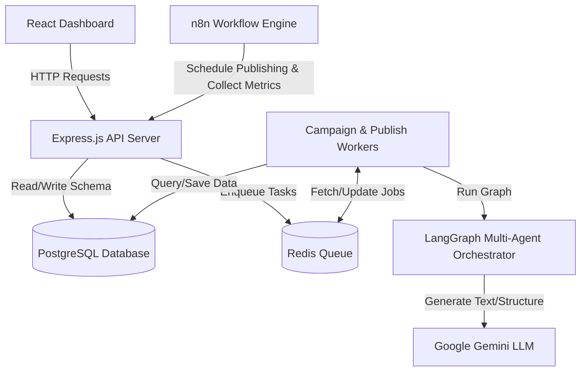

# DLF-Agent Component Justification Document

This document explains the technical purpose, role, and necessity of each major component in the DLF-Agent stack. It details how they work together to create a reliable, scalable, and multi-tenant AI marketing automation pipeline.

---

## Architecture Overview

---

## Component Breakdown

### 1. PostgreSQL (with Prisma Client)
* **What it is:** A relational database management system.
* **Why we need it:**
  - **Durable System of Record:** Multi-agent runs, generated copy, campaign histories, scheduled jobs, connected social tokens, and analytics need to be stored in a reliable, ACID-compliant database.
  - **Relational Integrity:** Features like foreign key constraints (e.g., ensuring a `Campaign` or `Product` belongs to a valid `Tenant`) protect the data from corruption.
  - **Prisma Integration:** Prisma serves as our Object-Relational Mapper (ORM), providing type-safe database queries (`prisma.product.create()`) and managing schema migrations cleanly.
* **Key Files:**
  - [schema.prisma](file:///d:/DLF-Agent/prisma/schema.prisma) — Database schema definitions, indexes, relations, and enums.
  - [prisma.ts](file:///d:/DLF-Agent/src/database/prisma.ts) — Prisma client initialization and database readiness checker.

### 2. Redis (with BullMQ)
* **What it is:** An in-memory key-value data structure store used as a message broker and queue backend.
* **Why we need it:**
  - **Asynchronous Task Decoupling:** AI processing (running a LangGraph of multiple LLM agents) and publishing to external social APIs (Instagram, X, etc.) are slow and network-heavy. Running them directly inside Express HTTP routes would cause timeouts and make the frontend lag. Redis allows us to offload these into a queue.
  - **BullMQ Orchestration:** BullMQ uses Redis to coordinate task states (`active`, `waiting`, `delayed`, `completed`, `failed`), manage worker locks (so a post is never published twice), track rate limits, and run automatic backoff retries on failure.
* **Key Files:**
  - [queues.ts](file:///d:/DLF-Agent/src/jobs/queues.ts) — BullMQ Queue definitions for campaign generation and publishing.
  - [campaign-generation.worker.ts](file:///d:/DLF-Agent/src/jobs/campaign-generation.worker.ts) — Background queue worker processing LangGraph campaign pipelines.
  - [publish.worker.ts](file:///d:/DLF-Agent/src/jobs/publish.worker.ts) — Background queue worker publishing posts to social APIs.

### 3. n8n Integration
* **What it is:** A workflow automation tool with a visual interface.
* **Why we need it:**
  - **Scheduled Triggers (Cron):** n8n acts as the external scheduler, periodically sending requests to the Express backend to check for due scheduled publish jobs.
  - **External Analytics Ingestion:** Instead of building complex polling microservices for third-party social media metrics, n8n handles the connection, pagination, and data parsing, forwarding normalized metrics back to our Express API.
  - **Notification Handoffs:** Can easily send Discord/Slack/Email alerts if worker queues fail or campaigns require manual user review.
* **Key Files:**
  - [n8n/](file:///d:/DLF-Agent/n8n/) — Directory for n8n workflow export JSON configuration.

### 4. LangGraph (Multi-Agent System)
* **What it is:** An agent orchestration library built on top of LangChain.
* **Why we need it:**
  - **Cyclical State Management:** Standard LLM call chains are linear. LangGraph lets us define loops, cycles, and conditional paths (e.g., *Product Analysis* -> *Creative Strategy* -> *Caption Generator* -> *Quality Checker* -> Loop back to Generator if check fails).
  - **State Preserves Context:** It manages the shared graph state across different agents, ensuring each agent gets the exact input it needs and appends its findings cleanly.
* **Key Files:**
  - [marketing-pipeline.graph.ts](file:///d:/DLF-Agent/src/agents/graphs/marketing-pipeline.graph.ts) — The core LangGraph state machine definition.

### 5. Google Gemini API (LLM & Vision Gateway)
* **What it is:** A suite of multimodal Large Language Models.
* **Why we need it:**
  - **Structured JSON Synthesis:** Used by the Product Analysis and Creative Strategy agents to return type-safe JSON objects adhering to Zod schemas.
  - **Creative Copywriting:** Customized tone, hashtags, and limits for caption generation across platforms.
  - **Vision Capability:** Essential for analyzing uploaded product images to synthesize strategic details (e.g. styling, colors, logo placement).

### 6. Express.js Backend (Node.js)
* **What it is:** A minimalist web framework for Node.js.
* **Why we need it:**
  - **REST API Hosting:** Standardized interface for creating/reading products, campaigns, posts, social credentials, and analytics.
  - **Tenant & Request Lifecycle Middleware:** Handles security headers, authentication verification (JWT), global request logging, and error mapping dynamically.
* **Key Files:**
  - [app.ts](file:///d:/DLF-Agent/src/app.ts) — Application setup.
  - [server.ts](file:///d:/DLF-Agent/src/server.ts) — Server listener with graceful shutdown logic.

### 7. React & Vite (Frontend Dashboard)
* **What it is:** React UI library compiled using the fast Vite builder.
* **Why we need it:**
  - **Review & Approval Interface:** AI-generated posts and resized creatives require human feedback. The frontend offers a dashboard to edit captions, view resized images, and approve posts.
  - **Tenant Space Configuration:** Let's users configure workspace parameters (like setting and validating Tenant UUIDs) and connection states.
